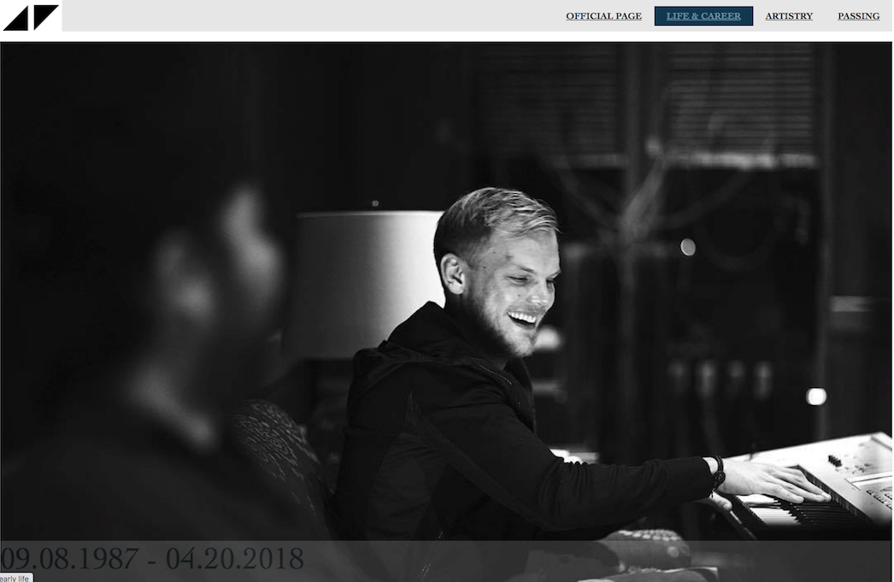
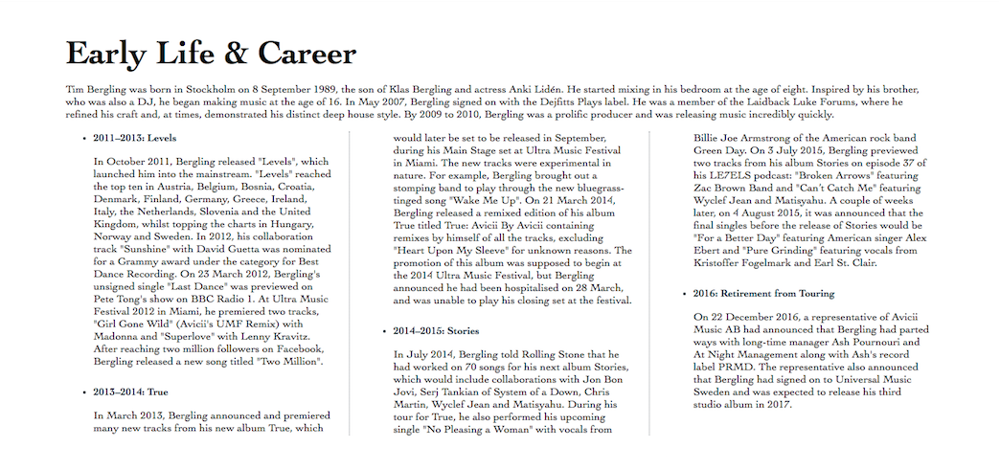
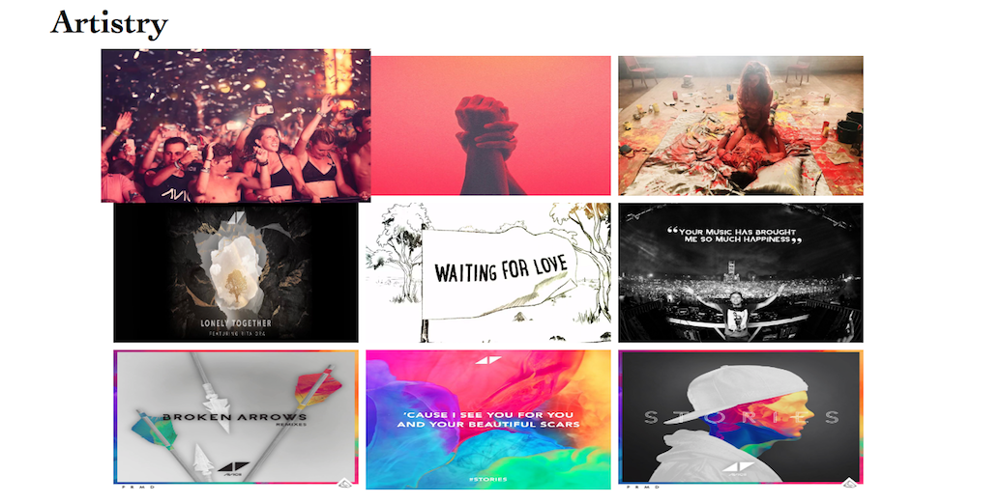
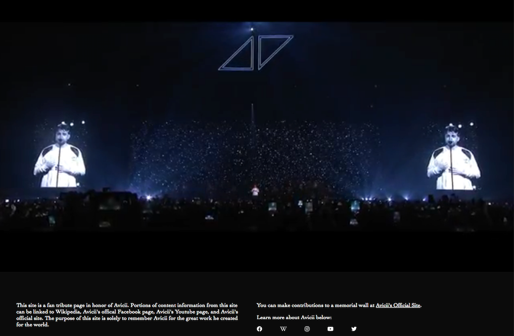

# Avicii Tribute Page   

**HTML5, CSS3**

A responsive, sample tribute page for the late artist, Tim Bergling (1989 - 2018). It encompasses information regarding Bergling's early life & career, artistry, and passing.

---

## Project Highlights

Project Section | Features
------------ | -------------
[Header](#Header) | Responsive navigation bar with hover effect; Links navigate users to other elements of the page or to external websites for futher information. 
[Main: Early Life & Career](#Main1) | Responsive text with columns that align the timeline of events.
[Main: Artistry](#Main2) | Flexbox design on images including hover effect to highlight individual images.
[Main: Passing](#Main3) | Responsive text with autoplay video including controls to pause, stop, or play video. 
[Footer](#Footer) | Icon links allow users to click to external websites.

## Header

## Main1

## Main2

## Main3

## Footer

---

## Contributors

Dany Chheang dany.chheang@gmail.com
